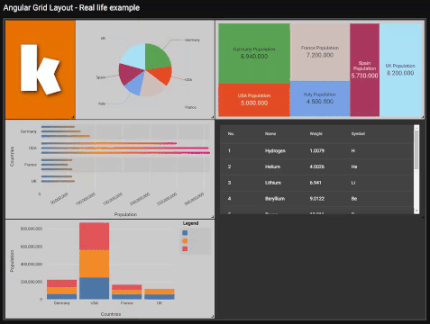

# Angular Grid Layout
[](https://www.npmjs.com/package/@katoid/angular-grid-layout)
[](https://github.com/katoid/angular-grid-layout/blob/main/LICENSE.md)
[](https://github.com/katoid/angular-grid-layout/commits/main)
[](https://github.com/katoid/angular-grid-layout/compare)

Angular Grid Layout is a grid layout system with draggable and resizable items for Angular Applications. It is mainly designed to create highly customizable dashboards.

Its core functionalities are based in the well known [React-Grid-Layout](https://github.com/STRML/react-grid-layout) library. It can be considered a 'port' (with some changes) to the Angular ecosystem.
Both cover the same necessities.



## Features
- No dependencies
- Draggable items
- Resizable items
- REDUX friendly (akita, ngrx, ngxs...)
- Customizable Drag & Resize handles.
- 3 modes of grid compaction: vertical, horizontal and free (exact same algorithm as [React-Grid-Layout](https://github.com/STRML/react-grid-layout))
- Add/Remove items
- High performance
- Supports touch devices
- Auto-scrolling while dragging

## Demos
[Playground](https://katoid.github.io/angular-grid-layout/playground) - [Stackblitz](https://stackblitz.com/edit/angular-grid-layout-playground?file=src%2Fapp%2Fplayground%2Fplayground.component.ts)

[Custom handles](https://katoid.github.io/angular-grid-layout/custom-handles)

[Real life example](https://katoid.github.io/angular-grid-layout/real-life-example)

## Installation

To use @katoid/angular-grid-layout in your project install it via [npm](https://www.npmjs.com/package/@katoid/angular-grid-layout):

```
npm install @katoid/angular-grid-layout --save
```

## Usage
Import KtdGridModule to the module where you want to use the grid:

```ts
import { KtdGridModule } from '@katoid/angular-grid-layout';

@NgModule({
  imports: [KtdGridModule]
})
```

Use it in your template:
```html
<ktd-grid [cols]="cols"
          [rowHeight]="rowHeight"
          [layout]="layout"
          (layoutUpdated)="onLayoutUpdated($event)">
    <ktd-grid-item *ngFor="let item of layout; trackBy:trackById" [id]="item.id">
        <!-- Your grid item content goes here -->
    </ktd-grid-item>
</ktd-grid>
```

Where template variables could be:
```ts
import { ktdTrackById } from '@katoid/angular-grid-layout';

cols: number = 6;
rowHeight: number = 100;
layout: KtdGridLayout = [
    {id: '0', x: 0, y: 0, w: 3, h: 3},
    {id: '1', x: 3, y: 0, w: 3, h: 3},
    {id: '2', x: 0, y: 3, w: 3, h: 3, minW: 2, minH: 3},
    {id: '3', x: 3, y: 3, w: 3, h: 3, minW: 2, maxW: 3, minH: 2, maxH: 5},
];
trackById = ktdTrackById
```

## API

Here is listed the basic API of both KtdGridComponent and KtdGridItemComponent. See source code for full knowledge of the API.

#### KtdGridComponent
```ts
/** Type of compaction that will be applied to the layout (vertical, horizontal or free). Defaults to 'vertical' */
@Input() compactType: KtdGridCompactType = 'vertical';

/** Row height in css pixels */
@Input() rowHeight: number = 100;

/** Number of columns  */
@Input() cols: number = 6;

/** Layout of the grid. Array of all the grid items with its 'id' and position on the grid. */
@Input() layout: KtdGridLayout;

/**
 * Parent element that contains the scroll. If an string is provided it would search that element by id on the dom.
 * If no data provided or null autoscroll is not performed.
 */
@Input() scrollableParent: HTMLElement | Document | string | null = null;

/** Number of CSS pixels that would be scrolled on each 'tick' when auto scroll is performed. */
@Input() scrollSpeed: number = 2;

/** Whether or not to update the internal layout when some dependent property change. */
@Input() compactOnPropsChange = true;

/** If true, grid items won't change position when being dragged over. Handy when using no compaction */
@Input() preventCollision = false;

/** Emits when layout change */
@Output() layoutUpdated: EventEmitter<KtdGridLayout> = new EventEmitter<KtdGridLayout>();

/** Emits when drag starts */
@Output() dragStarted: EventEmitter<KtdDragStart> = new EventEmitter<KtdDragStart>();

/** Emits when resize starts */
@Output() resizeStarted: EventEmitter<KtdResizeStart> = new EventEmitter<KtdResizeStart>();

/** Emits when drag ends */
@Output() dragEnded: EventEmitter<KtdDragEnd> = new EventEmitter<KtdDragEnd>();

/** Emits when resize ends */
@Output() resizeEnded: EventEmitter<KtdResizeEnd> = new EventEmitter<KtdResizeEnd>();

```

#### KtdGridItem
```ts
/** Id of the grid item. This property is strictly compulsory. */
@Input() id: string;

/** Whether the item is draggable or not. Defaults to true. */
@Input() draggable: boolean = true;

/** Whether the item is resizable or not. Defaults to true. */
@Input() resizable: boolean = true;

/** CSS transition style. Note that for more performance is preferable only make transition on transform property. */
@Input() transition: string = 'transform 500ms ease, width 500ms ease, height 500ms ease';

/** Minimum amount of pixels that the user should move before it starts the drag sequence. */
@Input() dragStartThreshold: number = 0;
```


## TODO features

- [x] Add delete feature to Playground page.
- [x] Add example with custom drag handles.
- [x] Add Real life example with charts and grid items with some kind of controls.
- [x] Add dragStartThreshold option to grid items.
- [x] Auto Scroll vertical/horizontal if container is scrollable when dragging a grid item. ([commit](https://github.com/katoid/angular-grid-layout/commit/d137d0e3f40cafdb5fdfd7b2bce4286670200c5d)).
- [x] Grid support for minWidth/maxWidth and minHeight/maxHeight on grid items.
- [ ] Add grid gap feature.
- [ ] rowHeight to support also 'fit' as value instead of only CSS pixels ([issue](https://github.com/katoid/angular-grid-layout/issues/1)).
- [ ] Grid support for static grid items.
- [ ] Customizable drag placeholder.
- [ ] Check grid compact horizontal algorithm, estrange behaviour when overflowing, also in react-grid-layout.
- [ ] Add all other resize options (now is only available 'se-resize').
- [ ] Documentation.

**IMPORTANT**: These features would be done in the near future. If any lib user needs them earlier, we encourage you to contribute to this project and speed up the process! To do so, please: 

1. Open an issue mentioning one of these features.
2. Explain your thoughts on how to implement it & we will discuss the possible solutions.
3. Do a Merge Request when the feature is done and tested.


## Troubleshooting
- Mutating the layout would cause an error like: 'ERROR TypeError: Cannot read property 'id' of undefined'. Never mutate the layout, always return a new instance when modifying it.
- Always use trackBy for the ngFor that renders the ktd-grid-items. If not, Angular would always re-render all items when layout changes.
- My Grid Item 'content' doesn't resize well when size changes. This may be caused for 'transform' property in ktd-grid-item, try to remove transform animations on 'width' and 'height' properties. You can also watch the real-life-example which uses other technique valid also.
